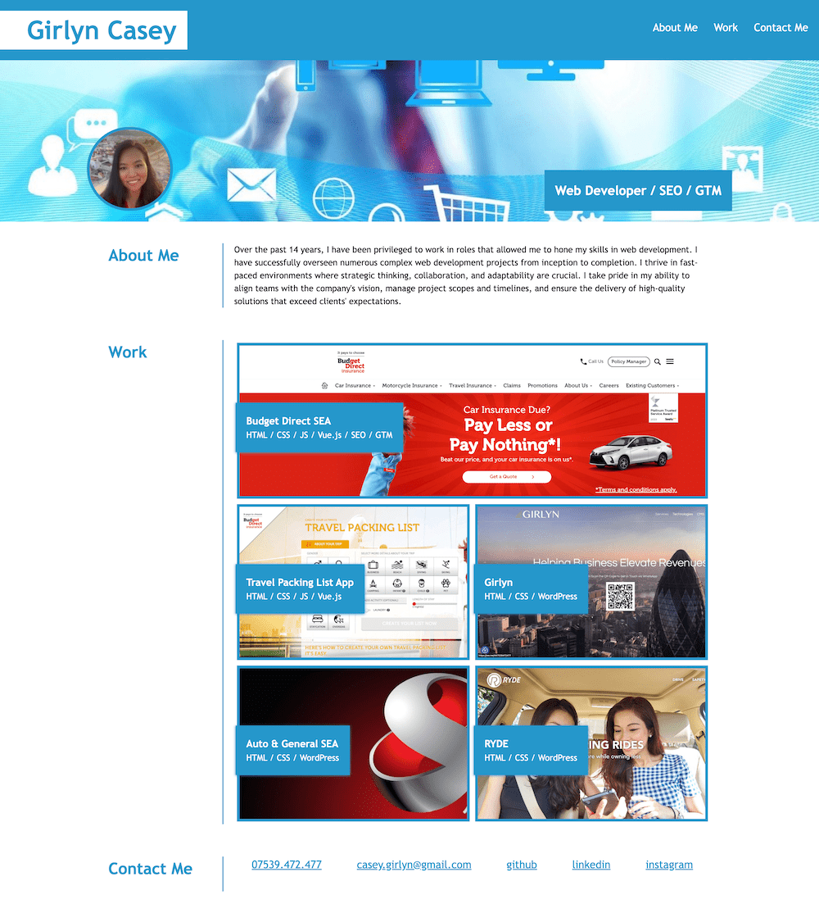

# Portfolio Website

Welcome to my portfolio website! This project showcases my skills and projects in a visually appealing and user-friendly manner.

## Table of Contents

- [Introduction](#introduction)
- [Features](#features)
- [Technologies Used](#technologies-used)
- [License](#license)

## Introduction

This portfolio website serves as a platform to present my professional background, skills, and notable projects. Its main purpose is to provide visitors with an overview of my abilities and accomplishments.

## Features

- **About Me:** A section introducing myself, my interests, and my career goals.
- **Work:** Displays a collection of my projects and links to each project.
- **Contact:** Provides various ways to get in touch with me.

## Technologies Used

- **Frontend:** HTML, CSS
- **Version Control:** Git
- **Code Quality:** Prettier

## Screenshot

## Usage

Feel free to explore the website to learn more about me, my skills, and the projects I've worked on. Click on project links to view detailed information about each project.

## License

This project is licensed under the [MIT License](LICENSE).

---

Thank you for visiting my portfolio website! Feel free to reach out to me for any inquiries or collaborations.